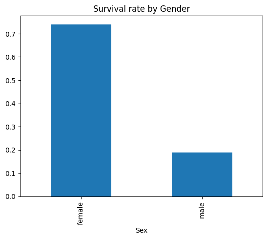
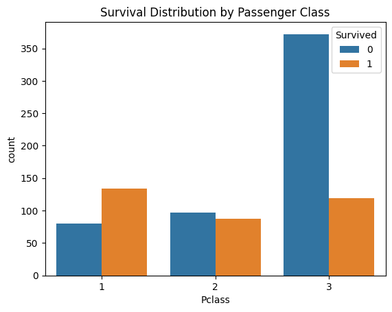

# Titanic Data Analysis
Data Analysis on Titanic dataset using Python (Pandas, Matplotlib)

## Objective
Analyze Titanic passenger data to find how age, gender and class affected survival.

## How I did it
- Data cleaning with Pandas (handled missing Age, dropped missing Embarked)
- Exploratory Data Analysis (survival rates by Sex, Pclass, Age groups)
- Visualizations saved in `/images`

## Key Insights
- Women had a significantly higher survival rate than men.
- Higher class passengers survived more often.
- Children had relatively better survival rate.

## Files
- `titanic.ipynb` — full notebook (EDA & code)
- `requirements.txt` — packages used
- `/images` — plots (PNG files)

## Dataset
Public dataset: https://raw.githubusercontent.com/datasciencedojo/datasets/master/titanic.csv

## Next steps
- Build a classification model (Logistic Regression / Random Forest)
- Deploy model demo (Streamlit)
- 
## Survival by Gender

## Survival by Passenger Class (Pclass)

## ✅ Model Accuracy

| Model                | Accuracy |
|---------------------|----------|
| Logistic Regression | 0.80     |

